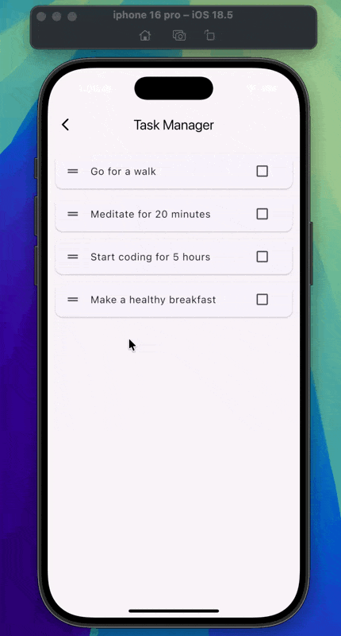

# 📝 Tasks Manager

A simple and elegant **Flutter Task Manager App** that helps you organize your daily tasks with ease.  
This project demonstrates **Flutter UI**, **state management with StatefulWidgets**, and common task operations like **adding, deleting, reordering, and completing tasks**.

---

## 📸 Demo



---

## 🚀 Features

- ✅ **Task List Display** – Preloaded daily routine tasks.  
- 🔄 **Reorderable List** – Drag & drop tasks to change their order.  
- ❌ **Swipe-to-Delete** – Delete tasks with a swipe gesture.  
- 🗑️ **Delete Confirmation** – Prevent accidental deletion with a confirmation dialog.  
- ↩️ **Undo Deletion** – Easily undo deleted tasks via `SnackBar`.  
- ✔️ **Mark Completed** – Tick tasks as completed with a checkbox (with strikethrough effect).  
- 🎨 **Modern UI** – Clean and light design with card-based task tiles.

---

## 🏗️ Project Structure

task_manager/
├── lib/
│   ├── main.dart        # Entry point of the app
│   └── home_view.dart   # Main screen containing task list and logic
├── screenshots/
│   └── demo.gif         # Project demo animation
├── test/                # Unit & widget tests
├── android/             # Android native files
├── ios/                 # iOS native files
├── web/                 # Web support
├── windows/             # Windows support
├── macos/               # macOS support
├── linux/               # Linux support
├── pubspec.yaml         # Dependencies & assets configuration
└── README.md            # Project documentation

---

## 🛠️ Code Overview

### `main.dart`

The entry point of the app, setting up the `MaterialApp` and loading the **HomeView**.

```dart
void main() {
  runApp(const TasksManagerApp());
}

home_view.dart

Implements the task list screen with:
 • ReorderableListView for drag & drop reordering
 • Dismissible widget for swipe-to-delete
 • Checkbox to mark tasks completed
 • SnackBar for undo functionality
 • Custom AppBar and card-based UI

⸻

📦 Dependencies

This project uses only Flutter’s core libraries, so no extra packages are required.

⸻

▶️ Getting Started

1️⃣ Clone the repository

git clone https://github.com/Riyam224/Tasks-manager---Dismissible_and_ReorderableList.git
cd task_manager

2️⃣ Install dependencies

flutter pub get

3️⃣ Run the app

flutter run


⸻

🤝 Contributing

Feel free to fork this repo and submit pull requests. Suggestions and improvements are always welcome!

⸻


